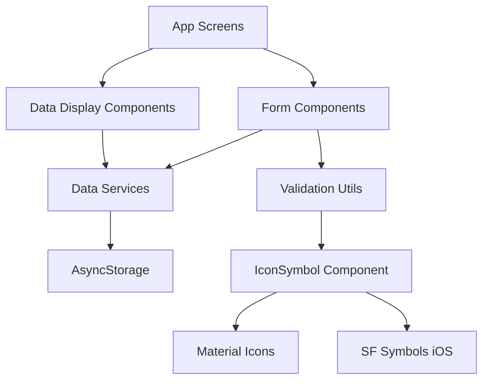

# Design Document

## Overview

This design implements a simple, robust data management system for the myVenti vehicle tracking application. The solution follows KISS, DRY, and YAGNI principles by leveraging React Native's built-in AsyncStorage for local data persistence, creating modular form components, and implementing icon fallback mechanisms. The design prioritizes simplicity over complex architecture while ensuring scalability and maintainability.

## Steering Document Alignment

### Technical Standards (tech.md)
Since no steering documents exist, this design follows established React Native and Expo best practices:
- Functional components with hooks for state management
- TypeScript interfaces for type safety
- Modular component architecture with single responsibilities
- Platform-agnostic design using expo-router

### Project Structure (structure.md)
Implementation follows the existing project conventions:
- Screen components in `app/(tabs)/` directory
- Reusable components in `components/` directory
- Utility functions and types in appropriate subdirectories
- Theme and styling adherence to `constants/theme.ts`

## Code Reuse Analysis

### Existing Components to Leverage
- **ThemedText & ThemedView**: Used throughout for consistent styling and dark/light theme support
- **IconSymbol**: Extended with additional mappings and fallback mechanisms for icon reliability
- **useColorScheme Hook**: Maintains consistent theme application across new components
- **Constants/Theme**: All styling follows established color schemes and spacing patterns
- **Tab Navigation Structure**: New modals and screens integrate with existing tab navigation

### Integration Points
- **Expo Router**: New forms and modals use file-based routing and navigation patterns
- **AsyncStorage**: Leverages Expo's AsyncStorage for simple, reliable local data persistence
- **Expo Symbols**: Enhanced IconSymbol component with expanded mappings and error handling

## Architecture

The architecture follows a simple layered approach focusing on separation of concerns and modularity:

### Modular Design Principles
- **Single File Responsibility**: Each component handles one specific form or data type
- **Component Isolation**: Small, focused form components rather than large monolithic screens
- **Service Layer Separation**: Data access logic separated from presentation components
- **Utility Modularity**: Validation and storage utilities in focused, single-purpose modules



## Components and Interfaces

### Data Service Layer
- **Purpose:** Centralized data management for vehicles, fuel entries, and service records
- **Interfaces:** CRUD operations (create, read, update, delete) for each data type
- **Dependencies:** AsyncStorage for persistence
- **Reuses:** TypeScript interfaces, existing theme colors and patterns

### Form Components
- **Purpose:** Modular forms for data entry with validation and submission handling
- **Interfaces:** Form props with validation rules and submission callbacks
- **Dependencies:** Data service layer, validation utilities
- **Reuses:** ThemedText, ThemedView, IconSymbol, existing styling patterns

### Enhanced IconSymbol
- **Purpose:** Robust icon rendering with fallback mechanisms and error handling
- **Interfaces:** Same API as existing IconSymbol for backward compatibility
- **Dependencies:** Material Icons, SF Symbols
- **Reuses:** Existing mapping structure with additional error handling

### Data Display Components
- **Purpose:** Enhanced list components with edit/delete functionality
- **Interfaces:** Props for data arrays and interaction handlers
- **Dependencies:** Data service layer, navigation
- **Reuses:** Existing card patterns, theme styling

## Data Models

### Vehicle Model
```typescript
interface Vehicle {
  id: string;
  name: string;
  year: number;
  make: string;
  model: string;
  type: 'gas' | 'electric' | 'hybrid';
  status: 'active' | 'inactive';
  createdAt: string;
  updatedAt: string;
}
```

### Fuel Entry Model
```typescript
interface FuelEntry {
  id: string;
  vehicleId: string;
  date: string;
  amount: number;
  quantity: number; // gallons for gas, kWh for electric
  pricePerUnit: number;
  mileage: number;
  mpg?: number; // calculated for gas vehicles only
  createdAt: string;
  updatedAt: string;
}
```

### Service Record Model
```typescript
interface ServiceRecord {
  id: string;
  vehicleId: string;
  date: string;
  type: string;
  description: string;
  cost: number;
  mileage: number;
  notes?: string;
  isCompleted: boolean;
  createdAt: string;
  updatedAt: string;
}
```

## Error Handling

### Error Scenarios
1. **Icon Not Found:** Icon name not in MAPPING object
   - **Handling:** Fallback to generic 'help' icon, log warning
   - **User Impact:** Sees appropriate fallback icon, no crash

2. **Storage Failure:** AsyncStorage read/write fails
   - **Handling:** Try-catch with user notification, fallback to memory storage
   - **User Impact:** Error message with option to retry, app continues functioning

3. **Validation Errors:** User submits invalid form data
   - **Handling:** Field-level error messages, prevent submission until valid
   - **User Impact:** Clear error messages, highlighted invalid fields

4. **Data Corruption:** Stored data format is invalid
   - **Handling:** Graceful fallback to empty arrays, log error for debugging
   - **User Impact:** Fresh start with default data, no crash

## Testing Strategy

### Unit Testing
- Focus on data service CRUD operations with mock AsyncStorage
- Test validation utility functions with various input scenarios
- Test form component rendering and interaction patterns
- Verify icon fallback behavior with invalid icon names

### Integration Testing
- Test form submission flow from UI to data storage
- Verify data consistency across different components
- Test edit/delete workflows with proper data updates
- Ensure navigation flows work correctly between screens

### End-to-End Testing
- Complete user journeys: add vehicle → add fuel entry → view statistics
- Edit workflows: modify existing data and verify updates across app
- Error scenarios: test invalid data submission and recovery
- Icon rendering: verify proper display across different platforms

## Implementation Approach

Following KISS principles, the implementation uses:
- **Simple State Management:** React hooks instead of complex state libraries
- **Minimal Dependencies:** Only adds AsyncStorage if not already present
- **Progressive Enhancement:** Start with basic forms, add features incrementally
- **TypeScript Integration:** Type safety without over-engineering

The design ensures each component has a single responsibility, utilities are focused and reusable, and the overall architecture remains simple and maintainable.