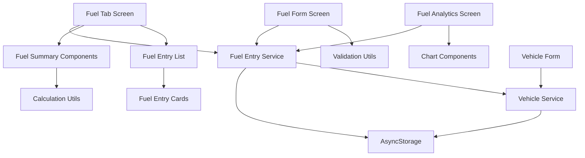

# Design Document

## Overview

The fuel management system design builds upon the existing sophisticated fuel tracking infrastructure in myVenti. This design focuses on enhancing and extending the current implementation to fully satisfy the comprehensive requirements while maintaining architectural consistency and leveraging existing patterns. The system provides complete fuel entry management, analytics, and multi-vehicle support with a mobile-first approach.

## Steering Document Alignment

### Technical Standards (tech.md)

The design follows established React Native Expo patterns with TypeScript strict mode implementation:

- **Component Architecture**: Uses functional components with hooks following the existing ThemedView/ThemedText pattern
- **Navigation**: Leverages Expo Router's file-based routing system with typed navigation
- **State Management**: Utilizes AsyncStorage-based service layer with comprehensive FuelService class
- **Type Safety**: Implements comprehensive TypeScript interfaces for all fuel-related data structures
- **Theme Integration**: Maintains automatic dark/light mode support through established theme system
- **Validation Framework**: Extends existing ValidationUtils and FuelValidation classes

### Project Structure (structure.md)

Implementation follows the established project organization:

```
app/
├── (tabs)/fuel.tsx          # Main fuel management screen
├── fuel/
│   ├── entry.tsx           # Fuel entry creation/editing screen
│   └── analytics.tsx       # Fuel analytics and reporting screen
components/
├── forms/
│   └── FuelForm.tsx        # Existing comprehensive fuel form
├── fuel/
│   ├── FuelEntryCard.tsx   # Individual fuel entry display
│   ├── FuelSummaryCard.tsx # Summary statistics component
│   └── FuelAnalyticsChart.tsx # Analytics visualization
services/
└── DataService.ts          # Existing FuelService with full CRUD operations
utils/
└── validation.ts           # Existing fuel validation framework
```

## Code Reuse Analysis

### Existing Components to Leverage

- **FuelForm Component**: Complete fuel entry form with vehicle type support, auto-calculation, and comprehensive validation
- **FuelService**: Full CRUD operations, MPG calculations, and monthly expense tracking
- **Themed Components**: ThemedView, ThemedText for consistent theme support
- **Validation Framework**: FuelValidation class with detailed business rules
- **Data Types**: Complete TypeScript interfaces (FuelEntry, FuelFormData, Vehicle)
- **Navigation Patterns**: Existing tab navigation and screen transitions

### Integration Points

- **VehicleService**: For vehicle selection and vehicle-specific data filtering
- **Theme System**: Constants and color schemes for consistent styling
- **AsyncStorage**: Local data persistence with established service patterns
- **Existing Fuel Screen**: Main fuel management interface with summary cards and entry list
- **Dashboard Integration**: Connection to existing dashboard summary statistics

## Architecture

The architecture follows a modular, service-oriented design with clear separation of concerns:

### Modular Design Principles

- **Single File Responsibility**: Each component handles one specific aspect of fuel management
- **Component Isolation**: Focused, reusable components rather than monolithic structures
- **Service Layer Separation**: Data access, business logic, and presentation layers are clearly separated
- **Utility Modularity**: Validation, formatting, and calculation utilities are in dedicated modules



## Components and Interfaces

### FuelScreen (app/(tabs)/fuel.tsx) - Enhancement
- **Purpose:** Main fuel management interface with enhanced filtering and search capabilities
- **Interfaces:** Pull-to-refresh, add entry navigation, vehicle filtering
- **Dependencies:** FuelService, VehicleService, existing summary cards
- **Reuses:** Current implementation with added search and advanced filtering

### EnhancedFuelForm (Extension of components/forms/FuelForm.tsx)
- **Purpose:** Enhanced fuel entry form with editing capabilities and improved validation feedback
- **Interfaces:** Form data submission, validation error display, vehicle type adaptation
- **Dependencies:** FuelService, VehicleService, validation utilities
- **Reuses:** Existing FuelForm component with added editing mode support

### FuelEntryCard (New - components/fuel/FuelEntryCard.tsx)
- **Purpose:** Individual fuel entry display with edit/delete actions and swipe gestures
- **Interfaces:** Long-press handling, swipe actions, vehicle-specific formatting
- **Dependencies:** FuelEntry type, theme system, haptic feedback
- **Reuses:** Existing card layouts and themed components

### FuelAnalyticsScreen (New - app/fuel/analytics.tsx)
- **Purpose:** Comprehensive analytics interface with visual charts and trend analysis
- **Interfaces:** Chart rendering, date range selection, vehicle comparison
- **Dependencies:** FuelService for data aggregation, charting library
- **Reuses:** Theme system, date formatting utilities, existing calculation logic

### FuelSearchFilter (New - components/fuel/FuelSearchFilter.tsx)
- **Purpose:** Advanced search and filtering component for fuel entries
- **Interfaces:** Search input, date range picker, price range slider, vehicle selector
- **Dependencies:** VehicleService, form validation, themed components
- **Reuses:** Existing form components and validation patterns

## Data Models

### FuelEntry (Enhanced - extends existing)
```typescript
interface FuelEntry {
  id: string;                    // UUID for unique identification
  vehicleId: string;             // Foreign key to Vehicle
  date: string;                  // ISO date string
  quantity: number;              // Gallons or kWh based on vehicle type
  pricePerUnit: number;          // Price per gallon or kWh
  totalAmount: number;           // Calculated total cost
  odometer: number;              // Vehicle mileage at fuel time
  mpg?: number;                  // Calculated MPG for gas vehicles
  fuelStation?: string;          // Optional fuel station name
  location?: {                   // Optional GPS coordinates
    latitude: number;
    longitude: number;
  };
  notes?: string;                // Optional user notes
  createdAt: string;             // Entry creation timestamp
  updatedAt: string;             // Last modification timestamp
}
```

### FuelAnalytics (New)
```typescript
interface FuelAnalytics {
  period: {
    start: string;
    end: string;
  };
  vehicleId?: string;            // Optional vehicle filter
  statistics: {
    totalFuel: number;
    totalCost: number;
    averageMPG: number;
    averageCostPerMile: number;
    tripsCount: number;
  };
  trends: {
    fuelEfficiency: number[];    // MPG over time
    costTrend: number[];         // Cost over time
    consumptionPattern: {        // Consumption by time period
      daily: number[];
      weekly: number[];
      monthly: number[];
    };
  };
}
```

### FuelSearchFilter (New)
```typescript
interface FuelSearchFilter {
  vehicleId?: string;            // Vehicle filter
  dateRange?: {
    start: string;
    end: string;
  };
  priceRange?: {
    min: number;
    max: number;
  };
  fuelStation?: string;          // Fuel station search term
  sortBy: 'date' | 'cost' | 'mpg'; // Sort preference
  sortOrder: 'asc' | 'desc';     // Sort direction
}
```

## Error Handling

### Error Scenarios

1. **Fuel Entry Validation Failures**
   - **Handling:** Real-time field validation with specific error messages
   - **User Impact:** Form fields highlighted with descriptive error text below invalid fields

2. **MPG Calculation Errors**
   - **Handling:** Graceful fallback when previous entries not available
   - **User Impact:** Manual MPG input option with helpful guidance

3. **Data Persistence Failures**
   - **Handling:** Local queueing with retry mechanism and user notification
   - **User Impact:** Clear error message with retry option and offline mode indication

4. **Vehicle Data Inconsistencies**
   - **Handling:** Validation against existing vehicle odometer readings
   - **User Impact:** Warning dialog for potential data entry errors

5. **Network Connectivity Issues**
   - **Handling:** Offline mode with read-only access to existing data
   - **User Impact:** Clear offline indicator with sync status

## Testing Strategy

### Unit Testing

- **Fuel Validation Logic:** Test all validation rules with edge cases
- **MPG Calculations:** Verify accurate calculations across different scenarios
- **Data Service Operations:** Test CRUD operations with various data states
- **Component Rendering:** Test individual components with different props

### Integration Testing

- **Form to Service Integration:** Test complete fuel entry creation flow
- **Navigation Flows:** Test screen transitions and parameter passing
- **Theme Integration:** Test dark/light mode across all fuel components
- **Vehicle Integration:** Test vehicle-specific fuel data filtering

### End-to-End Testing

- **Complete Fuel Entry Journey:** From entry creation to analytics viewing
- **Multi-Vehicle Scenarios:** Test fuel tracking across multiple vehicles
- **Data Import/Export:** Test backup and restore functionality
- **Performance Testing:** Test with large datasets (1000+ fuel entries)