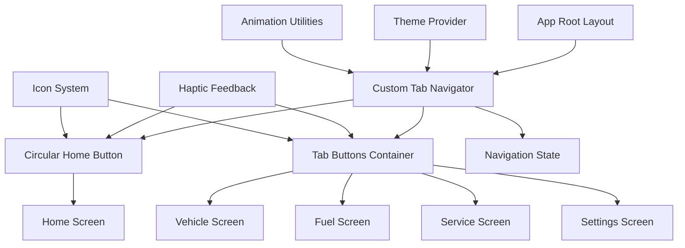

# Design Document

## Overview

This design document outlines the technical implementation for a modern, minimalistic layout for the MyVenti vehicle tracking system. The implementation will replace the current standard Expo Router tabs with a custom bottom navigation bar featuring a distinctive circular home button in the center. The design follows 2025 mobile UI/UX trends while leveraging the existing React Native/Expo Router foundation.

## Steering Document Alignment

### Technical Standards (tech.md)

The design leverages existing project patterns and technologies:
- **Expo Router**: Continues using expo-router for navigation with custom tab layout
- **React Native Reanimated**: Utilizes existing animation library for smooth transitions
- **Theme System**: Extends the existing Colors and Fonts constants for consistent styling
- **TypeScript**: Maintains type safety throughout the implementation
- **Component Architecture**: Follows existing modular component patterns

### Project Structure (structure.md)

The implementation follows the established project organization:
- **app/**: Screen components using expo-router file-based routing
- **components/**: Reusable UI components with clear separation of concerns
- **constants/**: Theme and styling constants
- **hooks/**: Custom React hooks for shared logic

## Code Reuse Analysis

### Existing Components to Leverage
- **HapticTab**: Extends for haptic feedback on navigation interactions
- **ThemedText/ThemedView**: Utilizes for consistent theming across all screens
- **IconSymbol**: Leverages for modern, consistent iconography
- **useColorScheme**: Reuses for dark/light theme detection

### Integration Points
- **Expo Router Navigation**: Integrates with existing file-based routing system
- **Theme Constants**: Connects to existing Colors and Fonts for consistency
- **Expo Haptics**: Utilizes existing haptic feedback system
- **React Native Safe Area Context**: Leverages for proper device spacing

## Architecture

The implementation follows a modular architecture with clear separation of concerns. The custom bottom navigation will be built using React Native's component system with Expo Router integration.

### Modular Design Principles
- **Single File Responsibility**: Custom navigation component, individual screen components, and utility functions are separated
- **Component Isolation**: Navigation logic is isolated from screen content
- **Service Layer Separation**: Navigation state management is separated from UI rendering
- **Utility Modularity**: Animation utilities and theme helpers are in focused modules



## Components and Interfaces

### CustomTabNavigator
- **Purpose:** Main navigation component replacing default Expo Router tabs
- **Interfaces:**
  - `state`: Navigation state object
  - `descriptors`: Screen descriptors from expo-router
  - `navigation`: Navigation prop from expo-router
- **Dependencies:** React Navigation, React Native Reanimated, SafeAreaView
- **Reuses:** HapticTab, useColorScheme, Theme constants

### CircularHomeButton
- **Purpose:** Distinctive circular button for home navigation positioned in center
- **Interfaces:**
  - `onPress`: Callback for home navigation
  - `active`: Boolean for active state styling
  - `colorScheme`: Current theme (light/dark)
- **Dependencies:** React Native Reanimated, Expo Haptics
- **Reuses:** IconSymbol, HapticTab functionality

### TabButton
- **Purpose:** Individual tab button with modern styling and animations
- **Interfaces:**
  - `onPress`: Navigation callback
  - `icon`: Icon name or component
  - `label`: Tab label text
  - `active`: Boolean for active state
- **Dependencies:** React Native Reanimated, Expo Haptics
- **Reuses:** IconSymbol, ThemedText, Colors theme

### HomeScreen
- **Purpose:** Central dashboard showing vehicle summaries and quick access cards
- **Interfaces:**
  - `navigation`: Navigation prop for routing
  - `vehicles`: Vehicle data array (to be connected to data layer)
- **Dependencies:** React Native components, Future vehicle data services
- **Reuses:** ThemedView, ThemedText, ParallaxScrollView

### VehicleScreen
- **Purpose:** Vehicle management screen for viewing and managing vehicle information
- **Interfaces:**
  - `navigation`: Navigation prop
  - `vehicles`: Vehicle data array
- **Dependencies:** React Native components, Future vehicle CRUD services
- **Reuses:** ThemedView, ThemedText

### FuelScreen
- **Purpose:** Fuel tracking screen for logging and viewing fuel entries
- **Interfaces:**
  - `navigation`: Navigation prop
  - `fuelEntries`: Fuel data array
- **Dependencies:** React Native components, Future fuel tracking services
- **Reuses:** ThemedView, ThemedText

### ServiceScreen
- **Purpose:** Service tracking screen for maintenance records and scheduling
- **Interfaces:**
  - `navigation`: Navigation prop
  - `serviceRecords`: Service data array
- **Dependencies:** React Native components, Future service tracking services
- **Reuses:** ThemedView, ThemedText

### SettingsScreen
- **Purpose:** App settings and configuration screen
- **Interfaces:**
  - `navigation`: Navigation prop
- **Dependencies:** React Native components, Future settings services
- **Reuses:** ThemedView, ThemedText

## Data Models

### NavigationTab
```typescript
interface NavigationTab {
  name: string;
  icon: string;
  active: boolean;
  onPress: () => void;
}
```

### VehicleSummary (for future data layer)
```typescript
interface VehicleSummary {
  id: string;
  make: string;
  model: string;
  year: number;
  lastService: Date;
  fuelEfficiency: number;
  totalMileage: number;
}
```

### FuelEntrySummary (for future data layer)
```typescript
interface FuelEntrySummary {
  id: string;
  vehicleId: string;
  date: Date;
  amount: number;
  cost: number;
  mileage: number;
}
```

### ServiceRecordSummary (for future data layer)
```typescript
interface ServiceRecordSummary {
  id: string;
  vehicleId: string;
  date: Date;
  type: string;
  cost: number;
  description: string;
}
```

## Error Handling

### Error Scenarios
1. **Navigation State Corruption**
   - **Handling:** Implement state validation and fallback to home screen
   - **User Impact:** App remains functional, returns to home screen

2. **Animation Performance Issues**
   - **Handling:** Graceful degradation to static navigation if animations fail
   - **User Impact:** Navigation still works, just without animations

3. **Theme Loading Failures**
   - **Handling:** Default to light theme with console logging
   - **User Impact:** App uses consistent default styling

4. **Route Resolution Errors**
   - **Handling:** Display error screen with retry option
   - **User Impact:** Clear error message with recovery path

## Testing Strategy

### Unit Testing
- **CustomTabNavigator**: Test navigation state management and tab rendering
- **CircularHomeButton**: Test press interactions and navigation behavior
- **TabButton**: Test active/inactive states and styling
- **Theme Integration**: Test light/dark theme switching
- **Animation Utilities**: Test animation timing and completion

### Integration Testing
- **Navigation Flow**: Test complete navigation between all screens
- **Expo Router Integration**: Test custom navigator with expo-router routing
- **Theme Consistency**: Test theme application across all screens
- **Haptic Feedback**: Test haptic responses on different platforms

### End-to-End Testing
- **User Journey**: Test complete user flow from home through all sections
- **Device Compatibility**: Test on iOS, Android, and web platforms
- **Responsive Design**: Test on various screen sizes and orientations
- **Performance**: Test navigation speed and animation smoothness