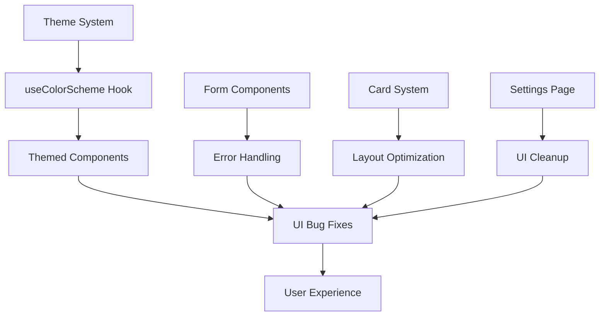

# Design Document

## Overview

This design document outlines the technical approach to fixing critical UI bugs in the myVenti Expo React Native application. The implementation will address theme switching functionality, card layout optimization, form stability improvements, and settings page cleanup. These fixes will leverage the existing well-structured theme system, component architecture, and form patterns already established in the codebase.

## Steering Document Alignment

### Technical Standards (tech.md)
The design follows the established technical patterns in the myVenti codebase:
- **Theme System**: Extends the existing centralized theme system in `constants/theme.ts`
- **Component Architecture**: Maintains the modular component structure with clear separation of concerns
- **TypeScript Integration**: Ensures full type safety following existing type definitions in `types/data.ts`
- **Expo Router Integration**: Leverages file-based routing with typed navigation
- **Accessibility Standards**: Continues the app's commitment to accessibility with proper labels and roles

### Project Structure (structure.md)
The implementation follows the established project organization:
- **Component Location**: Bug fixes will be applied to existing components in their current locations
- **Service Layer**: Utilizes existing service layer patterns for data operations
- **Hook Usage**: Leverages existing hooks like `use-color-scheme.ts` and `use-theme-color.ts`
- **Constants**: Extends existing theme constants and color definitions
- **Navigation**: Maintains compatibility with the custom navigation system

## Code Reuse Analysis

### Existing Components to Leverage
- **ThemedText & ThemedView**: Core theme-aware components for consistent theming
- **useColorScheme Hook**: Existing theme detection mechanism for automatic theme switching
- **Form Components**: FuelForm, VehicleForm, ServiceForm patterns for consistent form handling
- **Card System**: Existing card styling variants (cardCompact, quickActionCompact) in theme.ts
- **Navigation Components**: Custom tab navigator and navigation hooks
- **Error Handling**: Centralized error handling patterns with user-friendly alerts

### Integration Points
- **Theme Context**: Integration with existing theme provider in `_layout.tsx`
- **Settings System**: Integration with current settings page structure in `settings.tsx`
- **Form Validation**: Extension of existing form validation patterns
- **Storage System**: Integration with existing AsyncStorage patterns for theme persistence

## Architecture

The architecture follows a modular approach with focused fixes for each bug category:

### Modular Design Principles
- **Single File Responsibility**: Each fix targets specific components without affecting unrelated functionality
- **Component Isolation**: Bug fixes are isolated to maintain system stability
- **Service Layer Separation**: Form error handling separates presentation from business logic
- **Utility Modularity**: Theme switching logic leverages existing utility functions



## Components and Interfaces

### Theme Switching Component
- **Purpose:** Fix non-functional theme toggle and ensure proper theme persistence
- **Interfaces:** Extends existing `useColorScheme` hook with manual override functionality
- **Dependencies:** `constants/theme.ts`, existing theme provider
- **Reuses:** `ThemedText`, `ThemedView`, `use-theme-color.ts` hook

### Form Error Boundary Component
- **Purpose:** Prevent app crashes from form errors and provide graceful error handling
- **Interfaces:** React Error Boundary pattern with form-specific error recovery
- **Dependencies:** React Error Boundary API, existing form validation patterns
- **Reuses:** Existing form validation patterns, error alert system

### Compact Card Layout System
- **Purpose:** Optimize card layouts for better space utilization while maintaining readability
- **Interfaces:** Enhanced card styling variants with reduced padding and improved spacing
- **Dependencies:** `constants/theme.ts`, existing card system
- **Reuses:** `cardCompact` and `quickActionCompact` theme variants

### Settings Page Cleanup
- **Purpose:** Remove unimplemented location tracking features and streamline settings
- **Interfaces:** Simplified settings configuration without location-related options
- **Dependencies:** Existing settings page structure and navigation
- **Reuses:** Current settings component patterns and styling

## Data Models

### Theme Preference Model
```typescript
interface ThemePreference {
  mode: 'light' | 'dark' | 'system';
  isPersisted: boolean;
  lastUpdated: Date;
}
```

### Form Error State Model
```typescript
interface FormErrorState {
  hasError: boolean;
  errorType: 'validation' | 'network' | 'unexpected';
  errorMessage: string;
  canRecover: boolean;
}
```

### Card Layout Configuration Model
```typescript
interface CardLayoutConfig {
  paddingVertical: number;
  paddingHorizontal: number;
  spacing: number;
  compactMode: boolean;
}
```

## Error Handling

### Error Scenarios

1. **Theme Switching Failures**
   - **Handling:** Graceful fallback to system theme, user notification of preference reset
   - **User Impact:** Minimal - theme reverts to system default with informative message

2. **Form Rendering Errors**
   - **Handling:** Error boundary catches rendering errors, displays fallback UI with recovery options
   - **User Impact:** App remains stable, user can retry form or navigate away safely

3. **Storage Persistence Failures**
   - **Handling:** Theme preferences cached in memory, retry mechanism for storage operations
   - **User Impact:** Theme changes apply for current session, preferences saved when storage is available

4. **Component Mount Failures**
   - **Handling:** Individual component failures isolated, app continues functioning
   - **User Impact:** Specific feature may be unavailable but overall app remains usable

## Testing Strategy

### Unit Testing
- **Theme Switching Logic:** Test theme toggle functionality and persistence mechanisms
- **Form Error Handling:** Test error boundary catching and recovery scenarios
- **Card Layout Calculations:** Test responsive layout calculations and spacing
- **Settings Configuration:** Test settings page rendering without location options

### Integration Testing
- **Theme Context Integration:** Test theme changes across all components
- **Form Component Integration:** Test error handling in form submission flows
- **Navigation Integration:** Test settings navigation and menu cleanup
- **Storage Integration:** Test theme preference persistence and retrieval

### End-to-End Testing
- **Complete Theme Switching Flow:** Test user toggles theme, app persists, restarts with correct theme
- **Form Error Recovery Flow:** Test user encounters form error, recovers, continues using app
- **Settings Page Interaction Flow:** Test user navigates settings, sees only relevant options
- **Card Layout Responsiveness Flow:** Test app displays compact cards on different screen sizes

## Implementation Considerations

### Performance Impact
- **Theme Switching:** Optimized to complete within 100ms using existing theme context
- **Form Error Boundaries:** Minimal overhead, only active during form rendering
- **Card Layout Optimization:** Reduced padding improves rendering performance
- **Settings Cleanup:** Reduced component count improves page load performance

### Backward Compatibility
- **Theme System:** Maintains existing theme API and extends functionality
- **Form Components:** Preserves existing form interfaces while adding error handling
- **Card Styling:** Extends existing theme variants without breaking current implementations
- **Settings Navigation:** Removes unused options without affecting functional settings

### Platform-Specific Considerations
- **iOS/Android Theme Detection:** Leverages platform-specific theme detection APIs
- **Form Input Handling:** Maintains platform-appropriate keyboard and input patterns
- **Card Layout:** Responsive design adapts to different screen sizes across platforms
- **Settings Storage:** Uses platform-appropriate storage mechanisms for theme preferences